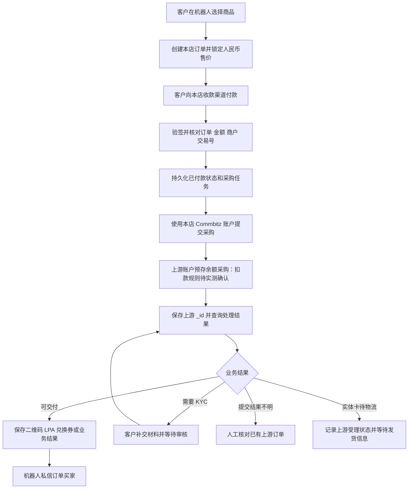

# Commbitz 转售 Bot 开发方案

## 1. 结论与当前状态

**当前资料足以开始实现转售 Bot。** 已有 PDF、公开 Swagger，以及真实 Live 鉴权和目录查询结果，正常采购与交付流程所需的主要接口已明确。

开发目标是：正常订单自动处理，采购结果不明、需要客户补充 KYC 或需要人工物流处理的订单进入可追踪的后续流程。

本文是待实施的开发方案，以下新增字段、状态和功能不代表已经写入运行代码。

| 层面 | 当前状态 |
| --- | --- |
| Telegram 商店、EPay 核单、本地订单、权限和持久化通知 | 已有代码和本地回归测试 |
| 上游资料 | 已取得 PDF，已整理；公开 Live/UAT Swagger 已读取 |
| 上游账户只读联调 | Live 鉴权、令牌刷新、国家目录、全部 11 个套餐及详情已成功 |
| 上游生产适配器 | 已实现（阶段 B/C）：采购状态机、全部业务输入、KYC 双模式上传、用量查询；配置 `upstream.provider: commbitz` 即启用 |
| 实际采购、钱包扣款、真实交付 | 尚未联调（KYC 上传代码已就绪） |
| 上线验收 | 尚未完成，不能把只读查询成功视为已可收款售卖 |

证据来源：

- [PDF 中文整理与 Live 查询记录](commbitz-api-integration.md)
- [公开 Swagger 补充](commbitz-api-integration.md#16-公开-swagger-与开发补充)
- [当前架构](architecture.md)
- [功能进度](progress.md)

## 2. 业务与资金流

约定：

1. 客户支付进入本店的收款账户；当前项目使用 EPay。
2. 本店自行设置人民币售价，保存到本店订单；客户付款后的金额不随套餐刷新变化。
3. 上游向本店返回的套餐报价目前均为 USD；上游报价、账户实际结算/钱包币种、本店人民币售价分开记录。
4. 目标采购方式是从本店上游预存余额扣款；扣款时点、余额不足返回和失败退回规则仍需验证。
5. 公开 `POST /v1/order/request-payment-link` 会创建上游收款链接并给客户发邮件；本项目结账继续使用本店的支付渠道，不接入该收款路径。
6. UAT 的客户定价接口未出现在当前 Live 定义中，本店定价由本地商品配置完成。

## 3. 业务范围与交付标准

全部五类业务都在开发范围内；每类分别验收和启用。

| 业务 | 需要采集/配置的信息 | 主要接口 | 完成与交付标准 |
| --- | --- | --- | --- |
| eSIM 新购 | SKU、数量；按需提供用户资料/KYC | `/v1/request`、`/v1/details/:id` | 数量匹配，取得可交付的全部 `esims[]`，保存并私信二维码/LPA/ICCID |
| 激活 | SKU、ICCID；按需 KYC | 同上 | 查到该请求的成功终态，通知激活结果；不把创建时的 `pending` 当成成功 |
| 充值 | SKU、手机号或 ICCID；按日套餐需天数 | 同上 | 查到该请求的成功终态，通知充值结果 |
| 兑换券 | SKU、数量 | 同上 | 获得兑换券内容并持久化；多数量返回结构在验收前确认 |
| 实体 SIM | SKU、数量；实际配送所需资料需补齐 | 同上 | 记录上游受理/后续物流状态；创建成功不自动记为实体卡已发货或签收 |
| KYC | 订单归属、证件文件或 HTTPS URL、必要用户资料 | 下单时附带材料或已有订单 KYC 接口 | 区分 `pending`、`submitted`、`verified`；确认供应商允许交付的时点 |
| 用量查询 | 订单所有权、对应 coupon/cid/orderId/imsi | `/esim/usage` | 按 Swagger 单位归一化，显示用量及套餐额度；未知值显示未知 |

设备兼容性和地区筛选可以作为售前扩展。Swagger 中的密码管理、短信收发等额外接口不属于当前确认的五类商品转售闭环，是否扩展单独确定。

## 4. 模块改造

| 模块 | 开发内容 |
| --- | --- |
| `config.py` | 增加上游提供商/环境、Secret Key、超时及后台查询配置；凭据由私密配置注入 |
| `services/commbitz_api.py`（计划新增） | 获取/刷新令牌、并发刷新协调、目录、全部请求类型、详情、KYC JSON/multipart、用量接口；安全错误归一化 |
| 上游业务适配器（计划新增） | 把本店订单映射为上游请求，管理提交记录、上游 ID、待处理状态和交付结果 |
| `models.py` / `db.py` | 商品 SKU/请求类型映射，订单输入快照，采购状态及请求证据，持久化上游 ID；旧库迁移 |
| `services/orders.py` | 分离收款确认和采购履约；保留已付款事实，增加等待/人工核对语义 |
| `services/fulfillment.py` | 从持久化任务恢复；已有上游 ID 时只查询；交付通知与采购分别重试 |
| `handlers/order.py` | 按业务类型采集 ICCID、号码、数量、天数等信息，确认页展示售价与可能的 KYC 要求 |
| 新增 KYC 处理器 | 私聊校验买家身份、展示提交用途、接收材料并提交给该订单所属的上游账户 |
| `handlers/admin.py` | 商品上架与本店定价、采购状态查询、人工绑定已有上游订单、受控重试、补发和人工退款记录 |
| `handlers/start.py` / 售后查询 | 订单状态、交付补发、KYC 待办、eSIM 用量；只允许订单买家和授权管理员查询 |

当前 `UpstreamClient.deliver()` 只返回成功/失败结果，接入异步上游需要增加“已受理待完成、需要 KYC、结果不明”等表达方式，不能只替换 HTTP 调用地址。

## 5. 数据与状态设计

以下为建议新增的数据，不是现有数据库字段清单。

### 5.1 商品与订单快照

- 商品：供应商、环境、SKU、套餐 `_id`、业务 `requestType`、可售状态、本店人民币售价。
- 上游报价：原始价格字段、币种、获取时间；不把任一价格字段未经确认就当作实际扣款价。
- 本店订单：创建时固定 SKU、业务类型、数量、天数、ICCID/号码、本店金额和币种。
- 采购账户上下文：至少区分提供商、环境、账户命名空间，避免把 Live 的上游订单 ID 用于 UAT。
- 上游凭据不进入商品、订单快照、备注或业务日志。

### 5.2 采购记录

每个本店订单创建一份受唯一约束保护的采购记录，保存：

- 本店订单 ID、规范化请求参数及可用于人工追踪的引用。
- 提交状态、提交开始时间、上游 `_id`、上游业务展示编号。
- 最近一次查询状态、查询时间、可安全记录的错误类别。
- KYC 待办/审核状态及已经返回的交付资料。

`hoiUserId` 标识最终用户，`notes` 可辅助人工追踪；原文没有承诺它们用于请求去重。

### 5.3 采购状态建议

| 建议状态 | 含义 | 恢复动作 |
| --- | --- | --- |
| `ready` | 已确认客户付款，尚未提交上游 | 领取任务，先持久化提交意图，再发起采购 |
| `submitting` | 已记录提交意图，正在等待创建响应 | 若进程在此中断且无上游 ID，转为 `submission_unknown` |
| `submission_unknown` | 上游可能已创建/扣款，但没有可靠 ID | 停止自动重新购买，人工核对并绑定已有订单或确认未创建 |
| `upstream_pending` | 已保存上游 `_id`，业务尚未完成 | 只调用详情查询，不重复创建 |
| `awaiting_kyc` | 客户需要补交材料 | 通知买家，等待其提交 |
| `kyc_submitted` | 已提交材料，尚未取得可交付确认 | 查询审核状态；不把“已有二维码”直接当作审核通过 |
| `ready_to_deliver` | 已确认可交付且内容完整 | 事务保存交付资料与通知任务 |
| `awaiting_dispatch` | 实体 SIM 已受理，后续配送未确认 | 维护物流/人工跟进，不通知“已签收” |
| `fulfilled` | 商品或业务结果已确认 | 根据通知状态补发，不重新采购 |
| `rejected` | 有明确失败结果 | 保留付款事实，由明确的重试/退款流程处理 |

本店收款状态与上述采购状态分别保存。采购失败、KYC 等待、通知失败，都不能让客户订单自动退回“未付款”。

## 6. 幂等、故障与通知规则

1. **支付回调幂等**：验签、核对商户/金额/订单/交易号，事务记录付款；重复回调返回成功。
2. **支付回调及时应答**：确认付款并保存采购任务后应答，将耗时的供应商请求交给后台执行。
3. **创建请求先留痕**：网络请求前保存提交记录。当前没有上游幂等承诺时，超时、断网、5xx、成功响应缺失 `_id` 都不能直接重新购买。
4. **立即保存 `_id`**：收到有效创建响应后，先持久化上游 ID，再查询交付资料。
5. **已知 ID 只查询**：采购等待、查询失败、通知失败和进程重启，不应触发第二个上游创建请求。
6. **人工核对有证据**：绑定已有上游订单时，核对账户归属、SKU/套餐、数量、业务类型和客户引用；绑定行为写入审计记录。
7. **KYC 独立恢复**：上传结果不明时先查询已有订单状态，不通过重新创建订单恢复。
8. **通知可恢复**：货品先保存，只私信订单买家；多张 eSIM 分条发送，避免超过 Telegram 消息长度。发送中断可能导致同一内容补发，但不再次采购。
9. **敏感信息按需使用**：不记录令牌、API 密钥、证件内容、完整 LPA、PIN/PUK；KYC 和设备信息仅向有权访问的用户展示。
10. **真实上游接入前更改恢复假设**：当前后台会恢复 `paid` 订单，必须先实现采购记录及上述规则，才能把模拟上游替换为 Commbitz。

## 7. 定价、KYC 与商品上架

### 7.1 定价

- 本店人民币售价独立配置，保存到本店订单。
- 当前 11 个 SKU 的报价币种为 USD；账户钱包币种和实际扣款仍待验证。
- UAT 客户定价说明确认“销售价与供应商分配采购价分开”，并在目录/详情中新增 `customerPricing`；该设置接口和响应字段在当前 Live 定义中不可见。
- Live 扣款采用的价格、币种、金额单位及失败退回规则，在实际采购对账后固定到适配器与测试中。

### 7.2 KYC

- 当前套餐的 `documentsRequired=false`、`ekyc=false` 是套餐级字段，不能自动关闭账户级或 INR 订单 KYC。
- 账户配置未知时，在购买流程中告知可能需要身份材料，并实现按实际订单状态补交/审核的路径。
- 证件仅在确认订单归属、说明提交对象并获得用户提交操作后转交供应商。
- `submitted` 已返回 eSIM 信息时，仍按上游确认的交付规则处理，不擅自把 `isKycVerified=false` 转成已审核。

### 7.3 上架规则

- 商品来自已分配目录，但“目录可见”不等于该账户已验证可执行所有业务。
- `planIsFor: 6/11` 尚无明确映射，保留原始值；确认允许的请求类型后再启用对应 SKU/业务。
- SKU 字面与名称规格不一致、名称含 `Enter Data` 的套餐，需要先核对规格。
- 对各业务分别设置上架状态；开发覆盖全部类型，销售启用以各类验收结果为准。

## 8. 开发阶段与验收

| 阶段 | 交付内容 | 验收依据 |
| --- | --- | --- |
| A：协议与目录 | 正式客户端、令牌缓存/刷新、商品同步、SKU 与本店定价 | 只读联调与脱敏夹具测试；不依赖采购 |
| B：采购与交付 | 采购记录、提交一次、详情轮询、货品持久化、买家私信、人工核对入口 | 模拟成功/等待/未知响应、并发与重启恢复测试 |
| C：全部业务 | 激活、充值、兑换券、实体 SIM 受理、KYC JSON/文件上传、用量展示 | 各请求类型和状态的合同测试；明确实体卡后续物流边界 |
| D：真实闭环 | 本店支付成功后完成授权范围内的供应商采购和交付 | 支付交易号、本店订单、上游 `_id`、采购金额/币种、后台余额变化、交付内容和通知记录可关联 |
| E：启用销售 | 经确认的 SKU/业务上架，配置监控和异常处理 | 每类业务均有验收结果，未确认的能力保留关闭或人工处理状态 |

本店真实收款联调还需配置测试机器人、EPay 商户信息、公网 HTTPS 回调地址及本店售价。当前上游密钥已经验证可用于 Live，创建请求必须按正式采购对待，并明确测试 SKU、数量和费用上限。

### 必须覆盖的测试

- 令牌到期、并发刷新、401 后的认证恢复；500/超时不能变成重复购买。
- 同一支付回调重复到达、不同订单并发、同一订单并发采购。
- 上游已创建但客户端未收到响应；本地保存 `_id` 前后分别中断。
- 查询返回 `pending`、业务失败、部分 eSIM、数量不匹配、缺少安装信息。
- KYC 未提交、已提交未审核、上传结果不明及后续恢复。
- 买家和管理员从群聊查询，货品仍只发送给订单买家；其他用户不可查询。
- 多张 eSIM 通知超长、Telegram 发送失败、补发不产生第二次采购。
- 用量缺失/可空字段、单位换算和订单所有权。
- 旧数据库升级不丢 SKU/付款/通知状态，不主动重发历史货品。

## 9. 可以开发与可以上线的区别

**可以开发：** 接口资料和只读访问已经足够，可以继续实现正常采购、交付、KYC 和售后流程，并把不确定结果做成人工核对分支。

**尚不能宣称已经可正式自动售卖：** 采购状态机与适配器已实现（阶段 B），但真实扣款、KYC 放行和交付尚未验收；启用真实采购前还必须完成 Live 对账。

真正阻止 Live 自动采购启用的项目是：真实资金规则尚未验证，以及缺少完整采购样本。适配器、采购记录、人工核对机制与 KYC/用量流程（阶段 B/C）已就绪。
